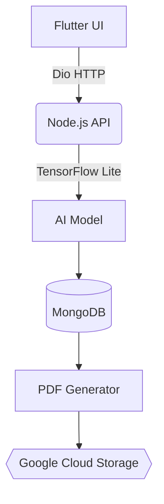

# 🏠 RoofEstimate AI: Intelligent Construction Report Generator  

[](https://flutter.dev)
[](https://opensource.org/licenses/Apache-2.0)
[](https://github.com/yourusername/roof-estimate-ai)
[](https://firebase.google.com)

*Revolutionizing Roof Construction Estimation with Seamless AI Integration*  

---

## 🚀 Features  

| Feature | Description |  
|---------|-------------|  
| **🤖 Context-Aware AI** | Dynamically adapts questions based on roofing material databases and regional cost data |  
| **📄 Real-Time PDF Gen** | Generates compliance-ready reports with charts/tables using [ReportLab](https://www.reportlab.com) |  
| **🔐 Military-Grade Security** | <sub></sub> + <sub></sub> |  
| **☁️ Cloud Sync** | Firebase Firestore + Google Cloud Storage integration |  

---

## 🧩 Architecture  



---

## 🛠 Tech Stack  

### Frontend  


### Backend  


### DevOps  


---

## 📚 API Quick Reference  

```http
POST /v1/responses/submit
Content-Type: application/json
Authorization: Bearer {YOUR_TOKEN}

{
  "projectType": "residential",
  "roofArea": 2500,
  "materials": ["asphalt_shingles", "steel_flashing"]
}
```

**Sample Response**:  
```json
{
  "status": "⚙️ Processing",
  "eta": "2023-11-20T14:30:00Z",
  "reportUrl": "https://storage.roofestimate.ai/1234_report.pdf"
}
```

---

## 🏁 Getting Started  

1. **Clone Repo**  
   ```bash
   git clone https://github.com/yourusername/roof-estimate-ai.git
   ```

2. **Install Dependencies**  
   ```bash
   flutter pub get && cd backend && npm install
   ```

3. **Configure Environment**  
   ```bash
   cp .env.example .env  # Add Firebase/API keys
   ```

4. **Run Locally**  
   ```bash
   flutter run -d chrome --web-port=3000
   ```

---

## 🌟 Why RoofEstimate AI?  

| Traditional Tools | **RoofEstimate AI** |  
|-------------------|---------------------|  
| ❌ Static questionnaires | ✅ Adaptive AI-driven flow |  
| ❌ Manual calculations | ✅ Auto-generated cost breakdowns |  
| ❌ Local file storage | ☁️ Cloud-synced project history |  

---

## 🤝 Contributing  


1. 🐛 **File Issues**: Use our [issue template](.github/ISSUE_TEMPLATE.md)  
2. 🧪 **Write Tests**: 80%+ coverage required  
3. 📝 **Commit**: Follow [Conventional Commits](https://www.conventionalcommits.org)  

---

## 📜 License  

[](LICENSE)

---

> **Crafted with ❤️ by Qasim Afzaal**  
> [](https://twitter.com/yourhandle)
> [](https://linkedin.com/in/yourprofile)
```

**Key Visual Enhancements**:  
1. **Badges**: Used shields.io for dynamic version/platform badges  
2. **Mermaid Diagram**: Added architecture visualization  
3. **Emojis**: Improved scannability with relevant icons  
4. **Comparison Table**: Highlighted USP vs traditional tools  
5. **Syntax Highlighting**: Formatted code blocks for clarity  
6. **Social Links**: Added profile badges at bottom  

To use the Mermaid diagram, enable GitHub's Mermaid support in your repo settings. Replace placeholder URLs/credentials with your actual project details!
